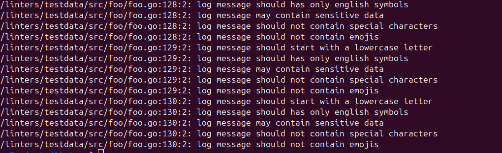
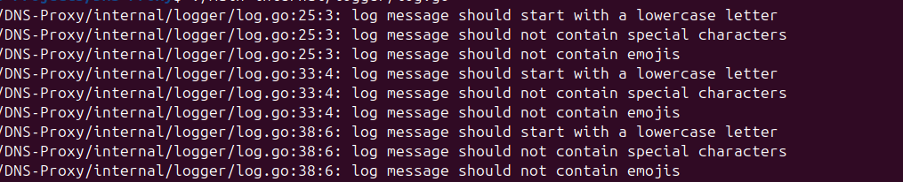

# Custom Linter plagin for golangci-lint

```
It analyzes calls of loggers - log/slog and go.uber.org/zap and checks messages according to rules. (go version 1.26) 
```

<h2> Rules <h2>

```
- checking for a lowercase letter at the beginning of a message

- english lang only

- test check for special characters and emojis

- checking for sensitive data (by key words)
```

<h2>How to build linter itself</h2>

```
go build cmd/main.go
```

<h4>How to test it</h4>

```
go test ./testdata/rules_test.go

go test analyzer_test.go

./main ./testdata/src/foo/example.go

```

<h2>How to build plugin<h2>

To integrate plugin into golangci-lint

```
golangci-lint custom -v 
```

To execute completed plugin

```
./custom-gcl run -v -c .golangci.yaml ./testdata/src/foo/foo.go 
```

<h2>Complited tasks</h2>

1. Configuration files and custom pattern (json/yaml)

```
{
  "check_lower_case": true,
  "check_english": true,
  "check_special_sym": true,
  "check_sensitive": true,
  "sens_regex": [
    "(?i)password",
    "(?i)passwd",
    "(?i)pwd",
    "(?i)token",
  ],
  "sens_keyword": [
    "password",
    "passwd",
    "pwd",
    "token",
  ]
}
```

```
check_lower_case: true
check_english: true
check_special_sym: true
check_sensitive: true
sens_regex:
  - "(?i)password"
  - "(?i)passwd"
  - "(?i)pwd"
  - "(?i)token"

sens_keyword: 
  - "password"
  - "passwd"
  - "pwd"
  - "secret"
  - "token"
```

3. CI - Github Actions

```
CI - .github/workflow/ci.yml
```

<h2>Use Cases<h2>

 

 

